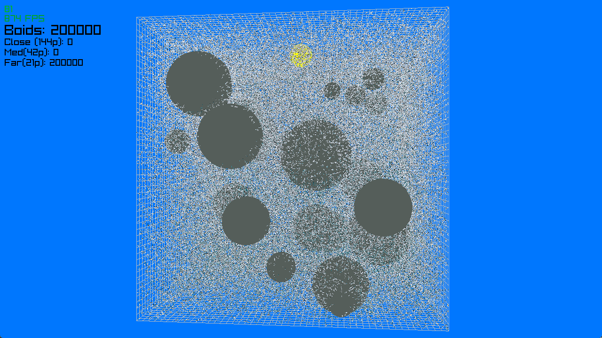

Here is GIF (Too large so it might take time to load the gif), 

# 3D Boids Simulation — Performance Progress Report
# 3D 群れシミュレーション — パフォーマンス改善レポート
#     ぐん                        かいぜん

---

## Hardware / 環境
##          かんきょう

- **GPU:** NVIDIA RTX 2060
- **Engine / エンジン:** raylib (C++)
- **Compute / 計算:** CUDA 13.2
              けいさん

---

## Progression / 進捗
##               しんちょく

| Stage | Boids | FPS | Technique used |
|-------|-------|-----|----------------|
| 0 | 5,000 | 80 | CPU-only, `DrawMeshInstanced` |
| 1 | 10,000 | 80 | + CUDA flocking kernel + spatial grid |
| 2 | 13,000 | 60 | + CUB radix sort (replaced Thrust) |
| 3 | 16,000 | 60 | + Pinned host memory (`cudaMallocHost`) |
| 4 | 20,000 | 64 | + Async double buffering |
| 5 | 35,000 | 60 | + LOD system (3 mesh tiers) |
| 6 | 52,000 | 60 | + CUDA–OpenGL interop |
| 7 | 150,000 | 60 | + Release build (was stuck in Debug) |
| 8 | 200,000 | 60 | + Tuned world/grid/perception parameters |

| 段階   | 数    | FPS | 使った技術              |
| だんかい | かず |     | つか  ぎじゅつ          |
|-------|-------|-----|------------------------|
| 0 | 5,000 | 80 | CPU のみ、`DrawMeshInstanced` |
| 1 | 10,000 | 80 | + CUDA 群れカーネル + 空間グリッド |
|   |        |    |     ぐん           くうかん       |
| 2 | 13,000 | 60 | + CUB ラディックスソート (Thrust から変更) |
|   |        |    |                                    へんこう   |
| 3 | 16,000 | 60 | + 固定メモリ (`cudaMallocHost`) |
|   |        |    |   こてい                          |
| 4 | 20,000 | 64 | + 非同期ダブルバッファリング |
|   |        |    |    ひどうき                   |
| 5 | 35,000 | 60 | + LOD システム (3段階メッシュ) |
|   |        |    |                   だんかい     |
| 6 | 52,000 | 60 | + CUDA–OpenGL 相互運用 |
|   |        |    |               そうごうんよう |
| 7 | 150,000 | 60 | + Release ビルド (Debug で詰まっていた) |
|   |         |    |                          つ            |
| 8 | 200,000 | 60 | + ワールド/グリッド/視野パラメータ調整 |
|   |         |    |                       しや        ちょうせい |

---

## What Each Step Did / 各段階の内容
##                    かくだんかい ないよう

### Stage 0 → 1: CPU → GPU simulation

**EN:** Moved flocking logic (separation / alignment / cohesion + obstacle avoidance) from CPU to a CUDA kernel. Added a 3D spatial grid so each boid only checks 27 nearby cells instead of every other boid.

**JP:** 群れの計算 (分離・整列・結合 + 障害物回避) を CPU から CUDA カーネルへ移動。空間グリッドで近くの 27 セルだけ確認。

---

### Stage 1 → 2: CUB radix sort

**EN:** `thrust::sort_by_key` was allocating and freeing GPU memory every frame — a hidden performance killer. Replaced with `cub::DeviceRadixSort` using a persistent temp buffer allocated once.

**JP:** `thrust::sort_by_key` は毎フレーム内部で `cudaMalloc` / `cudaFree` していた。`cub::DeviceRadixSort` に置き換え、バッファを一度だけ確保して再利用。

---

### Stage 2 → 3: Pinned memory

**EN:** `cudaMemcpy` DtoH was the frame bottleneck. Switching host arrays to `cudaMallocHost` (page-locked memory) made the copy 2–3× faster.

**JP:** `cudaMemcpy` (GPU → CPU) がボトルネックだった。`cudaMallocHost` で固定メモリを使うと転送が 2〜3 倍速くなる。

---

### Stage 3 → 4: Async double buffering

**EN:** Compute frame N+1 while drawing frame N. Used `cudaMemcpyAsync` with two buffer sets on a dedicated CUDA stream so CPU matrix building overlaps with GPU transfer.

**JP:** フレーム N+1 の計算とフレーム N の描画を並行させる。`cudaMemcpyAsync` とバッファ 2 つで、CPU の行列計算と GPU 転送が重なるようにした。

---

### Stage 4 → 5: LOD system

**EN:** 3 fish mesh variants (144 / 42 / 21 faces) selected per boid by distance to camera. Instead of drawing 480-face fish everywhere, distant boids use the 50-face version.

**JP:** 魚メッシュを 3 種類 (144 / 42 / 21 面) 用意。カメラからの距離で選ぶ。遠い魚は 50 面の軽い版。

---

### Stage 5 → 6: CUDA–OpenGL interop

**EN:** CUDA writes transform matrices **directly into GL vertex buffers** — zero CPU roundtrip. `cudaGraphicsGLRegisterBuffer` lets one VRAM buffer be shared between CUDA and OpenGL.

**JP:** CUDA が変換行列を直接 GL バッファに書き込む。CPU 経由がゼロに。`cudaGraphicsGLRegisterBuffer` で同じ VRAM バッファを CUDA と OpenGL で共有。

---

### Stage 6 → 7: Release build

**EN:** Debug build uses nvcc `-G` flag which disables GPU optimizations, making CUDA 5–10× slower. Also had to re-route the Release .exe to NVIDIA GPU in Windows Graphics Settings (was defaulting to AMD integrated).

**JP:** Debug ビルドは nvcc の `-G` フラグで最適化がオフ、CUDA が 5〜10 倍遅くなる。また Release の .exe を Windows 設定で NVIDIA に割り当てし直す必要あり (AMD 内蔵に戻っていた)。

---

### Stage 7 → 8: Parameter tuning

**EN:** Adjusted world size, grid cell size, and perception radius. Lower boid density per cell = fewer neighbor checks per frame. Visual behavior preserved.

**JP:** ワールドサイズ、セルサイズ、視野半径を調整。セルあたりのボイドが減って近隣チェックが減る。見た目の挙動は維持。

---

## Key Debugging Moments / 重要なデバッグ
##                       じゅうよう

**EN:**
- Profiled with **Nsight Systems** to identify bottlenecks instead of guessing.
- Discovered CUDA was running on NVIDIA while display ran on AMD integrated GPU — cross-GPU copy stalls were invisible but deadly.
- Found `cudaFree` bars in the profile timeline — traced them to Thrust's hidden internal allocations.

**JP:**
- **Nsight Systems** でプロファイルし、推測ではなく計測でボトルネックを特定。
- CUDA が NVIDIA で動き、画面は AMD 内蔵 GPU という状態を発見。GPU 間コピーが見えない遅延の原因。
- プロファイルの `cudaFree` バーから Thrust の内部確保を発見。

---

## Summary / まとめ

**EN:** From **5,000 boids (CPU)** to **260,000 boids (GPU)** at 60fps on an RTX 2060 — a **52×** increase. Each step was driven by measurement, not guesswork.

**JP:** **5,000 匹 (CPU)** から **260,000 匹 (GPU)** へ、RTX 2060 で 60fps 維持。**52 倍** の向上。各ステップは推測ではなく計測に基づいて判断。
